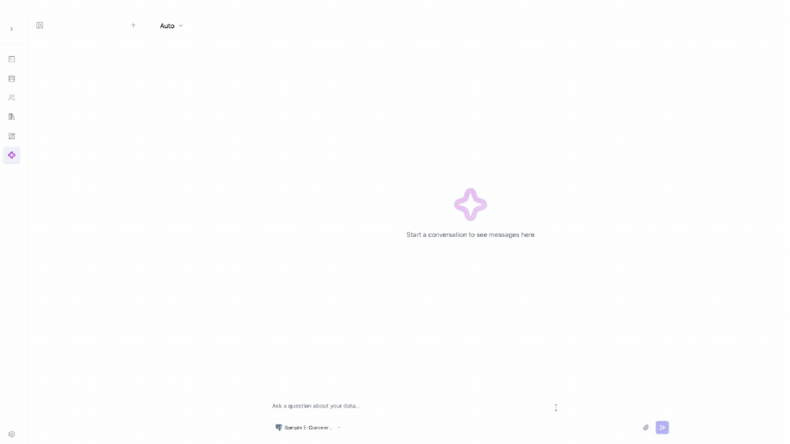
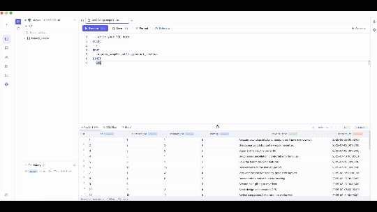
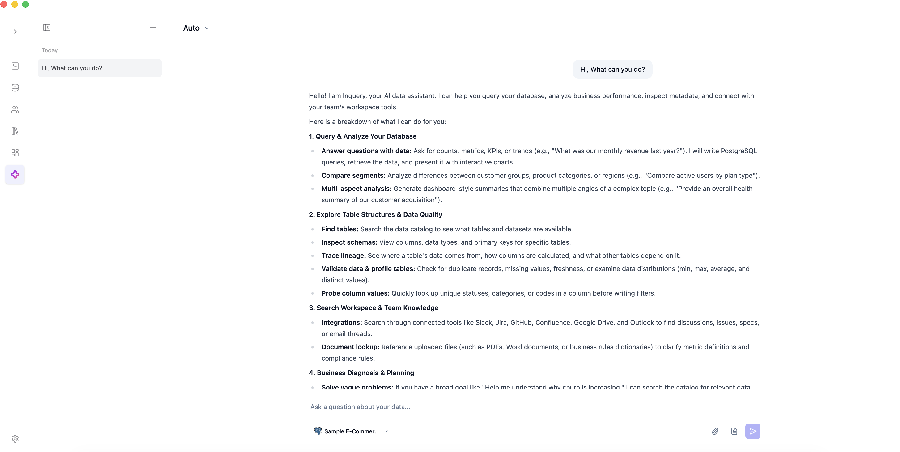
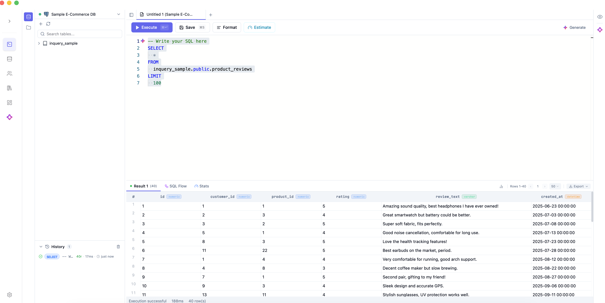
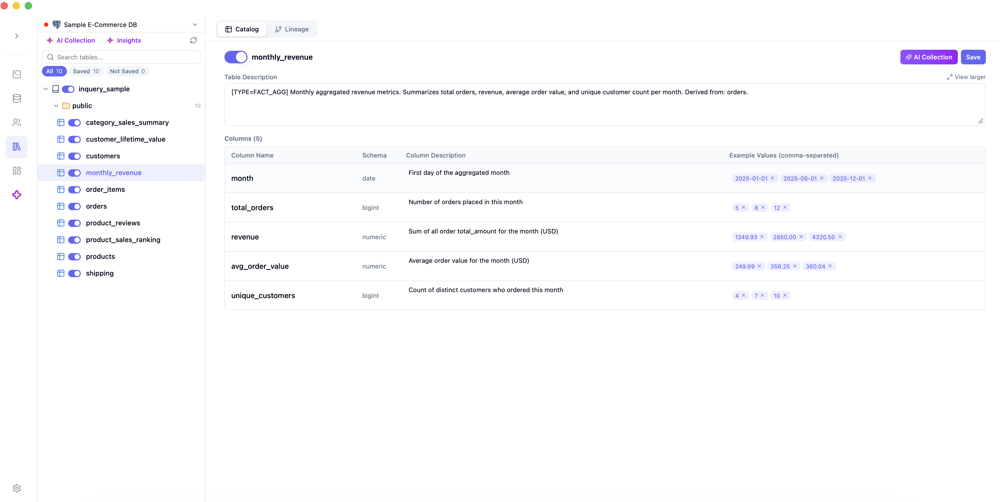
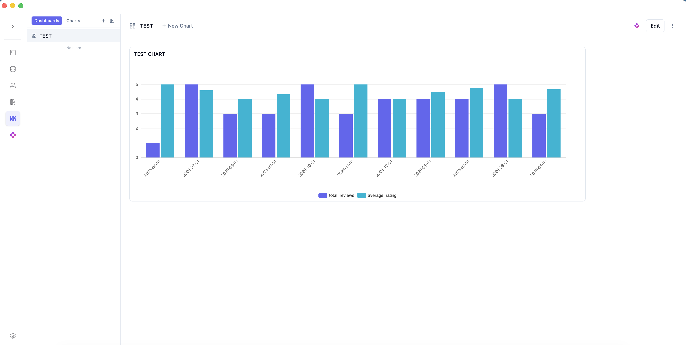
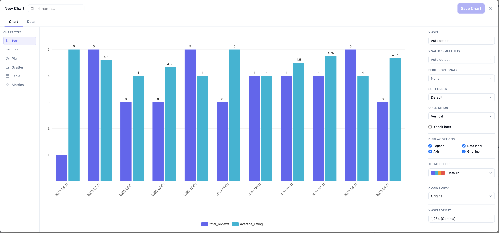
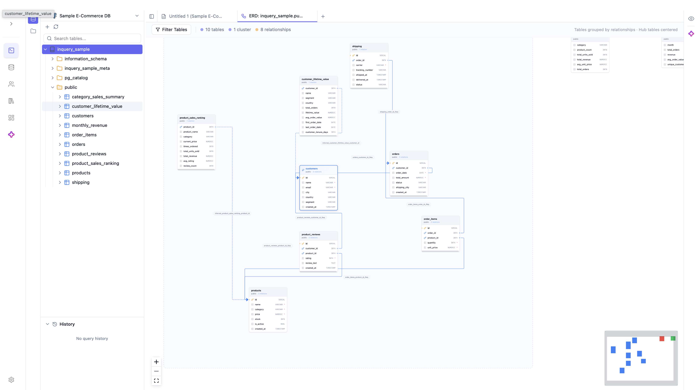
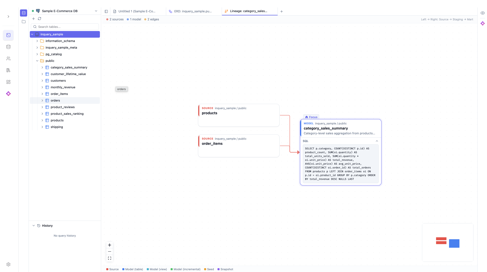

# Inquery

AI-powered database query assistant that converts natural language to SQL.

**Repository:** [github.com/jeonghyeondang/inquery](https://github.com/jeonghyeondang/inquery)

## Demo

### AI Chat

Ask in natural language — Inquery finds the right tables, runs SQL, and returns charts plus insights.



### SQL Workspace

Write SQL, browse schemas, and see results instantly — all in one workspace.



## Screenshots

### AI Chat

Ask questions in natural language. Inquery writes SQL, explores schemas, searches Slack/Jira/GitHub/Confluence, and builds charts from your data.



### SQL Workspace

Full-featured SQL editor with schema browser, AI **Generate**, query history, execution stats, and export.



### Data Catalog

AI-powered metadata: table descriptions, column docs, sample values, and lineage — with one-click **AI Collection**.



### Dashboards & Charts

Pin charts to dashboards or build new visualizations with the drag-and-drop chart editor (bar, line, pie, scatter, table, metrics).

<table>
  <tr>
    <td width="50%"></td>
    <td width="50%"></td>
  </tr>
  <tr>
    <td align="center"><sub>Dashboard</sub></td>
    <td align="center"><sub>Chart Builder</sub></td>
  </tr>
</table>

### ERD Visualization

Explore table relationships with an interactive entity-relationship diagram — foreign keys, column types, and schema layout at a glance.



### Data Lineage

Trace how tables connect upstream and downstream — see source queries, dependencies, and impact across your schema.



## Features

| Feature | Description |
|---|---|
| AI Chat | Natural language to SQL with LangChain4j agents |
| Deep Agent | Multi-agent supervisor pattern with automatic retry |
| Deep Research | Comprehensive research reports with infographic generation |
| Data Catalog | AI-powered schema documentation and metadata management |
| Vector Search | Semantic search over database schemas for context-aware SQL generation |
| Auto-Execute | Automatically execute generated SQL queries |

## Integrations

Connect external services so AI Chat can search team knowledge, post updates, and enrich the Data Catalog — alongside your database. Configure everything under **Settings → AI → AI Integration**.

### AI Chat — Search & Context

| Integration | What Inquery can do | How to connect |
|---|---|---|
| **Slack** | Search channels and past messages | User token |
| **Confluence** | Search wiki pages and documentation | Atlassian site URL + API token |
| **Jira** | Search issues, sprints, and boards | Atlassian site URL + API token |
| **GitHub** | Search repos, PRs, issues, commits, and source code | Personal access token |
| **Google Drive** | Search Docs and Sheets | OAuth (Client ID + Client Secret) |
| **Microsoft Outlook** | Search mailbox email | OAuth via Microsoft Entra (`Mail.Read`) |
| **Reference Documents** | Search uploaded PDF, Word, and Markdown files | Upload files in Settings |
| **Web Search** | Real-time public information (news, events, etc.) | AI provider API key in **Settings → AI** |

The AI agent picks the right search tool based on your question — for example, checking Jira tickets, finding a Confluence spec, or locating DDL in GitHub while querying your database in the same conversation.

### AI Chat — Write Actions

Write operations require explicit user approval before anything is sent:

| Integration | Action |
|---|---|
| **Slack** | Post a message to a channel |
| **Confluence** | Create a wiki page |
| **Jira** | Create an issue |

### Data Catalog & Lineage

| Integration | What Inquery can do | How to connect |
|---|---|---|
| **dbt** | Import model metadata and build lineage graphs | Git repo, `manifest.json` / `catalog.json` artifact URLs, or dbt Cloud API |
| **Reference Documents** | Ground AI metadata collection on internal specs and data dictionaries | Upload PDF, Word, or Markdown in Settings |

### Slack Bot

Run Inquery inside Slack — team members can ask data questions from channels or DMs without opening the web app. Configure under **Settings → Slack** with a Bot Token and App Token (Socket Mode).

## Architecture

```
┌──────────────┐     ┌──────────────────┐     ┌──────────────────┐
│   Frontend   │────▶│     Backend      │────▶│  User Database   │
│  SvelteKit   │     │  Spring Boot     │     │  (15 databases   │
│  :3000       │     │  :10821          │     │   supported)     │
└──────────────┘     └───────┬──────────┘     └──────────────────┘
                    ┌────────┴────────┐
                    │                 │
              ┌─────▼─────┐   ┌──────▼──────┐
              │ PostgreSQL │   │  Vector DB  │
              │ (App DB)   │   │ (pgvector / │
              │ :5432      │   │  Qdrant /   │
              └────────────┘   │  Pinecone)  │
                               └─────────────┘
```

## Quick Start

### Option 1: Desktop App (macOS only, Apple Silicon)

Install and run locally on **macOS Apple Silicon (M1/M2/M3/M4)** — no separate server or database setup required. Everything runs inside the app.

> **Beta:** Desktop packaging is currently maintained for macOS only. Windows and Linux builds are not supported yet.

| OS | Build Command | Output |
|---|---|---|
| macOS (Apple Silicon) | `./build-desktop.sh` | `.dmg` |

```bash
./build-desktop.sh
```

The build script will:
1. Build the Java backend JAR
2. Create a minimal JRE using jlink
3. Build the SvelteKit frontend (static)
4. Package everything into a macOS `.dmg` via Tauri

**What's included in the desktop app:**
- Embedded PostgreSQL (auto-starts on port 15432)
- Bundled JRE (no Java installation needed)
- pgvector as default Vector DB (no external service required)
- Native macOS window (overlay title bar)

> **Build prerequisites (macOS Apple Silicon):** Java 17+, Maven 3.9+, Node.js 20+, Rust toolchain, Xcode Command Line Tools, Homebrew `postgresql@18` (for pgvector compile during build)
>
> Install Rust if needed:
> ```bash
> brew install rust
> # or: curl --proto '=https' --tlsv1.2 -sSf https://sh.rustup.rs | sh
> ```

**Quick dev test (without building a `.dmg`):**

Stop any existing local dev servers first (`npm run dev` on port 3000, backend on port 10821) so Tauri can bind those ports.

```bash
# Terminal 1 — backend (desktop profile)
cd inquery-server
mvn clean package -DskipTests
java --add-opens=java.base/java.nio=ALL-UNNAMED \
     --add-opens=java.base/sun.nio.ch=ALL-UNNAMED \
     --add-opens=java.base/java.lang=ALL-UNNAMED \
     -Dspring.profiles.active=desktop \
     -jar inquery-server-web-start/target/inquery-server-web-start.jar

# Terminal 2 — Tauri shell
cd inquery-client-svelte
npm install
npx tauri dev
```

Sign in with the default administrator account (same as local dev):

| Username | Password |
|---|---|
| `admin123` | `admin1234` |

> **Security:** Change this password immediately after first login.

### Option 2: Docker Compose (Recommended for servers)

Run the entire stack with a single command.

```bash
# Copy and configure environment variables
cp .env.example .env
# Edit .env with your preferred settings

# Start all services
docker compose up -d
```

This starts:
- **PostgreSQL** (pgvector-enabled) on port 5432
- **Backend** (Spring Boot) on port 10821
- **Frontend** (SvelteKit) on port 3000
- **Nginx** reverse proxy on port 80

Access the app at `http://localhost` (port 80).

### Option 3: Local Development

Run frontend and backend separately for development.

#### Prerequisites

- **Java 17+** (ARM64 recommended for Apple Silicon — see [JDK Note](#jdk-note-for-apple-silicon))
- **Maven 3.9+**
- **Node.js 20+**

> No separate PostgreSQL installation is required. The `dev` profile auto-starts an **embedded pgvector-enabled PostgreSQL** on port `15432` (database `inquery_desktop`, user/password `inquery` / `inquery`). It also runs Flyway migrations automatically on first start.

#### 1. Start Backend

```bash
cd inquery-server
mvn spring-boot:run -pl inquery-server-web-start \
                    -Dspring-boot.run.profiles=dev
```

Or build a JAR and run it manually:

```bash
cd inquery-server
mvn clean package -DskipTests
java --add-opens=java.base/java.nio=ALL-UNNAMED \
     --add-opens=java.base/sun.nio.ch=ALL-UNNAMED \
     --add-opens=java.base/java.lang=ALL-UNNAMED \
     -Dspring.profiles.active=dev \
     -jar inquery-server-web-start/target/inquery-server-web-start.jar
```

> **Note:** When using the JAR-based flow, re-run `mvn package` after any backend code change. `mvn spring-boot:run` picks up changes automatically on restart.

Backend starts on `http://localhost:10821`.

#### 2. Start Frontend

```bash
cd inquery-client-svelte
npm install
npm run dev
```

Frontend starts on `http://localhost:3000` and proxies `/api/*` to the backend.

#### 3. Log In

Open `http://localhost:3000` and sign in with the default administrator account:

| Username | Password |
|---|---|
| `admin123` | `admin1234` |

> **Security:** Change this password immediately after first login. The default credentials exist only to bootstrap a fresh database.

#### Using an External PostgreSQL (optional)

If you'd rather use your own PostgreSQL instead of the embedded one, set `EMBEDDED_PG=false` and override the datasource via environment variables or `application-dev.yml`. Make sure the `vector` extension is installed:

```sql
CREATE EXTENSION IF NOT EXISTS vector;
```

A ready-to-use Docker Compose for a standalone pgvector PostgreSQL is available at `docker/docker-compose-postgres.yml`.

#### Connecting to Databases (JDBC Drivers Required)

> **Important — read this if you see `Connection failed, please check the connection information`.**

To keep the build lightweight and avoid shipping third-party binaries, Inquery does **not** bundle JDBC driver JARs, and automatic downloads **on connect** are **disabled** for security. When you connect to a database (including the built-in **Sample E-Commerce DB**), the backend loads the driver from:

```
~/.inquery/jdbc-lib/
```

If the required JAR is missing from this folder, the connection fails (e.g. `Connection failed, please check the connection information`, or `connection.driver.load.error`). This is **not** caused by a missing PostgreSQL installation — the `dev` profile already runs an embedded PostgreSQL.

**Easiest way — use the in-app button.** In the connection form (New Connection / Edit Connection), if no driver is installed for the selected database you'll see a **`Download Driver`** button. Clicking it downloads the driver from the official source into `~/.inquery/jdbc-lib/` for you. Drivers shipped as a zip bundle (e.g. **BigQuery**, which contains ~60 JARs) are extracted automatically. If you have a custom/licensed driver, use **`Upload Custom Driver`** instead.

The manual `curl` steps below are an alternative when you prefer the command line or the in-app download is unavailable.

**To make the bundled Sample E-Commerce DB work**, place the PostgreSQL driver there:

```bash
mkdir -p ~/.inquery/jdbc-lib
curl -L -o ~/.inquery/jdbc-lib/postgresql-42.5.1.jar \
  https://repo1.maven.org/maven2/org/postgresql/postgresql/42.5.1/postgresql-42.5.1.jar
```

Then re-open the connection (no backend restart needed). For other databases, download the matching driver JAR into the same folder. **The file name must match exactly**, since the loader resolves drivers by file name:

| Database | Driver JAR (exact file name) | Maven Central download |
|---|---|---|
| PostgreSQL | `postgresql-42.5.1.jar` | `org/postgresql/postgresql/42.5.1/` |
| MySQL | `mysql-connector-j-8.0.33.jar` | `com/mysql/mysql-connector-j/8.0.33/` |
| MariaDB | `mariadb-java-client-3.0.8.jar` | `org/mariadb/jdbc/mariadb-java-client/3.0.8/` |
| Snowflake | `snowflake-jdbc-3.27.0.jar` | `net/snowflake/snowflake-jdbc/3.27.0/` |
| SQLite | `sqlite-jdbc-3.39.3.0.jar` | `org/xerial/sqlite-jdbc/3.39.3.0/` |
| Oracle | `ojdbc11-21.5.0.0.jar` (+ `orai18n`, `xmlparserv2`, `xdb`) | `com/oracle/database/jdbc/ojdbc11/21.5.0.0/` |

> Maven Central URLs follow the pattern `https://repo1.maven.org/maven2/<path>/<file>.jar`. Drivers with many transitive JARs (e.g. **BigQuery**, **Databricks**) are easiest to install via the in-app **`Download Driver`** button, which fetches the vendor's official bundle and unpacks every JAR into `~/.inquery/jdbc-lib/` automatically. To do it manually, download the vendor's JDBC distribution zip and unzip all JARs into that folder, e.g. for BigQuery:
>
> ```bash
> cd ~/.inquery/jdbc-lib
> curl -L -o simba-bq.zip \
>   https://storage.googleapis.com/simba-bq-release/jdbc/SimbaJDBCDriverforGoogleBigQuery42_1.6.5.1001.zip
> unzip -j -o simba-bq.zip '*.jar' && rm simba-bq.zip
> ```

## Vector Database Setup

Inquery supports three vector databases for schema embedding storage and semantic search. Configure your choice in **Settings > Vector DB**.

### pgvector (Default, Recommended)

Uses your existing PostgreSQL — zero extra infrastructure. This is the default vector store; no configuration required.

| | |
|---|---|
| **Embedding Model** | Built-in all-MiniLM-L6-v2 (384 dims, runs locally) |
| **API Key Required** | No |
| **Extra Setup** | None (auto-creates table and extension) |

The pgvector extension is pre-installed when using the provided Docker images (`pgvector/pgvector:pg16`). For local PostgreSQL, run `CREATE EXTENSION IF NOT EXISTS vector;`.

### Qdrant

Open-source vector database with dedicated vector search engine.

| | |
|---|---|
| **Embedding Model** | Built-in all-MiniLM-L6-v2 (384 dims, runs locally) |
| **API Key Required** | No (self-hosted) / Yes (Qdrant Cloud) |
| **Extra Setup** | Docker container or Qdrant Cloud account |

**Self-hosted (Docker):**

```bash
docker run -d --name qdrant -p 6333:6333 -p 6334:6334 qdrant/qdrant
```

Connects to `localhost:6334` by default. No API key needed.

**Qdrant Cloud:**

Sign up at [cloud.qdrant.io](https://cloud.qdrant.io), create a cluster, then enter the host URL and API key in Settings.

### Pinecone

Managed cloud vector database with hybrid search (dense + BM25 sparse).

| | |
|---|---|
| **Embedding Model** | Gemini or OpenAI API (512 dims) |
| **API Key Required** | Yes (Pinecone + Gemini/OpenAI) |
| **Extra Setup** | Pinecone account and index |

Requires an AI API key (Gemini or OpenAI) configured in **Settings > AI** for embedding generation.

## Tech Stack

| Component | Technology |
|---|---|
| Backend | Java 17, Spring Boot, Maven multi-module |
| AI Framework | LangChain4j 1.9.0 |
| Frontend | Svelte 5, SvelteKit, TypeScript, Tailwind CSS 4 |
| UI Library | shadcn-svelte, bits-ui |
| Desktop App | Tauri 2.0 — macOS Apple Silicon (beta) |
| App Database | PostgreSQL (embedded by default in dev & desktop modes) |
| Vector Search | pgvector / Qdrant / Pinecone |
| Supported DBs | MySQL, PostgreSQL, Snowflake, BigQuery, Oracle, SQL Server, MariaDB, SQLite, MongoDB, ClickHouse, DB2, Hive, Presto, Databricks, Redis |

## Supported Databases

| Database | Plugin |
|---|---|
| MySQL | inquery-mysql |
| PostgreSQL | inquery-postgresql |
| Snowflake | inquery-snowflake |
| BigQuery | inquery-bigquery |
| Oracle | inquery-oracle |
| SQL Server | inquery-sqlserver |
| MariaDB | inquery-mariadb |
| SQLite | inquery-sqlite |
| MongoDB | inquery-mongodb |
| ClickHouse | inquery-clickhouse |
| DB2 | inquery-db2 |
| Hive | inquery-hive |
| Presto | inquery-presto |
| Databricks | inquery-databricks |
| Redis | inquery-redis (NoSQL) |

## AI Model Support

Configure AI models in **Settings > AI**.

| Provider | Recommended model | Notes |
|---|---|---|
| Google Gemini | `gemini-3.5-flash` | |
| Anthropic Claude | `claude-sonnet-4-6` | |
| OpenAI | `gpt-5.4-mini` | `gpt-5.5` is also supported but slow with function tools (chat-completions caps it to `medium` reasoning effort); pick it only when you need flagship quality. |

## Environment Variables

See [`.env.example`](.env.example) for Docker Compose configuration.

| Variable | Default | Description |
|---|---|---|
| `POSTGRES_DB` | `inquery` | PostgreSQL database name |
| `POSTGRES_USER` | `inquery` | PostgreSQL username |
| `POSTGRES_PASSWORD` | — | PostgreSQL password |
| `JWT_SECRET` | — | Secret key for JWT token signing |
| `CORS_ALLOWED_ORIGINS` | `*` | Allowed CORS origins |
| `APP_PORT` | `80` | Exposed port for Nginx |

## JDK Note for Apple Silicon

If you're on Apple Silicon (M1/M2/M3/M4), make sure to use an **ARM64 (aarch64) JDK**. The local ONNX embedding model (used by pgvector and Qdrant) requires native ARM64 libraries that don't work with x86_64 JDKs running under Rosetta.

```bash
# Install ARM64 JDK via Homebrew
brew install openjdk@21

# Set as default
export JAVA_HOME=/opt/homebrew/opt/openjdk@21/libexec/openjdk.jdk/Contents/Home
export PATH="$JAVA_HOME/bin:$PATH"
```

Verify with:

```bash
file $(which java)
# Should show: Mach-O 64-bit executable arm64
```

## Troubleshooting

### `Connection failed, please check the connection information`

The JDBC driver for that database is missing from `~/.inquery/jdbc-lib/`. This is the most common first-run issue and even affects the built-in **Sample E-Commerce DB** (which needs the PostgreSQL driver). The quickest fix is the **`Download Driver`** button in the connection form; for the manual route or details (including BigQuery's multi-JAR bundle), see [Connecting to Databases (JDBC Drivers Required)](#connecting-to-databases-jdbc-drivers-required). It is **not** related to having PostgreSQL installed locally; the `dev` profile runs an embedded PostgreSQL.

If a connection fails with `connection.driver.load.error`, the backend log will now show a clear message such as `JDBC driver not installed: 'GoogleBigQueryJDBC42.jar' is missing...` indicating exactly which JAR(s) to install.

### Sample data loads but Vector Search / semantic context is missing

If the backend log shows `extension "vector" is not available`, the pgvector extension is not installed on the PostgreSQL you're using. The embedded `dev` PostgreSQL and the provided Docker image (`pgvector/pgvector:pg16`) include it. For an external PostgreSQL, run:

```sql
CREATE EXTENSION IF NOT EXISTS vector;
```

### `Unable to locate a Java Runtime` / wrong Java version

The backend requires **Java 17**. Verify with `java -version`. On Apple Silicon, use an ARM64 JDK — see [JDK Note for Apple Silicon](#jdk-note-for-apple-silicon).

### Frontend loads but every `/api/*` call fails (`ECONNREFUSED`)

The backend isn't running. The frontend (port `3000`) proxies `/api/*` to the backend on port `10821`; start the backend first.

## Project Structure

```
inquery/
├── inquery-server/                 # Java Spring Boot backend
│   ├── inquery-server-domain/      # Domain layer (API, Core, Repository)
│   ├── inquery-server-web/         # Web layer (Controllers, Services)
│   ├── inquery-server-web-start/   # Application entry point
│   └── Dockerfile
├── inquery-client-svelte/          # SvelteKit frontend
│   ├── src/
│   │   ├── routes/(main)/          # Page routes
│   │   └── lib/                    # Components, stores, services
│   ├── src-tauri/                  # Tauri desktop app (Rust)
│   │   ├── src/                    # Rust sidecar launcher
│   │   ├── resources/              # JRE + JAR (generated by build script)
│   │   ├── capabilities/           # Tauri permissions
│   │   └── tauri.conf.json         # Tauri configuration
│   └── Dockerfile
├── docker/
│   ├── docker-compose-postgres.yml # Standalone PostgreSQL for local dev
│   └── nginx/nginx.conf            # Nginx reverse proxy config
├── build-desktop.sh                # Desktop DMG build automation
├── docker-compose.yml              # Full stack Docker Compose
└── .env.example                    # Environment variables template
```

## Contact

- Email: yhed10@gmail.com
- GitHub Issues: [github.com/jeonghyeondang/inquery/issues](https://github.com/jeonghyeondang/inquery/issues)

## Contributing

See [CONTRIBUTING.md](CONTRIBUTING.md) for development setup and pull request guidelines.

Report security vulnerabilities privately — see [SECURITY.md](SECURITY.md).

## License

Licensed under the [Apache License 2.0](LICENSE).

Third-party attributions for vendored or adapted source code are listed in [NOTICE](NOTICE).
