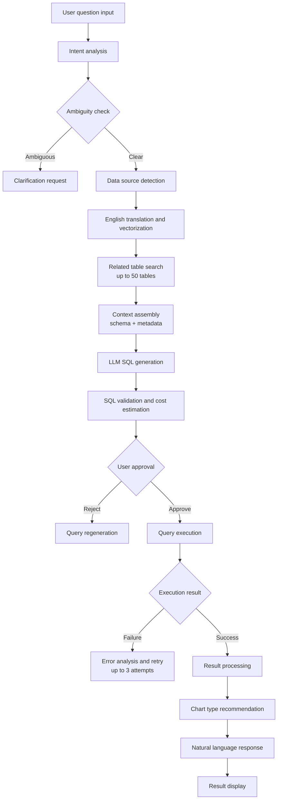

# System Architecture Overview

## Core Processing Flow



---

## Major Component Structure

### 1. Query Processing Engine

#### 1.1 Intent Analyzer
- **Input**: Natural language question (any language)
- **Processing**:
  - Query type classification: SELECT, AGGREGATE, JOIN, NESTED
  - Data source detection: INTERNAL, EXTERNAL, MIXED
  - Time range detection: HISTORICAL, REALTIME, PREDICTIVE
  - Complexity calculation: SIMPLE, MODERATE, COMPLEX
  - Ambiguity detection: unclear terms, multiple interpretations
- **Output**: QueryIntent object

#### 1.2 Schema Search Engine
- **Vector search process**:
  1. Question → English translation (improves search accuracy)
  2. Text → vector embedding
  3. Similarity search in vector DB (top 50)
  4. Data catalog metadata lookup
  5. Low-cardinality column value collection (e.g. platform=['WEB', 'APP'])

- **Vector DB document structure**:
```text
Document contents:
├── Table information
│   ├── Table name
│   ├── Table description (business meaning)
│   ├── Data refresh cadence
│   └── Owner / responsible team
├── Column information
│   ├── Column name
│   ├── Data type
│   ├── Column description
│   ├── Sample values (5-10)
│   ├── NULL allowed
│   └── Notes (PK, FK, index, etc.)
├── Relationship information
│   ├── Joinable tables
│   ├── Join conditions
│   └── Relationship type (1:1, 1:N, N:M)
└── Usage examples
    ├── Common query patterns
    ├── Filter examples
    └── Aggregation examples
```

- **Context assembly**:
  - DDL information
  - Column descriptions and sample data
  - Business rules
  - Similar query examples (few-shot learning)

#### 1.3 SQL Generator
- **Chain-of-Thought approach**:
  1. Identify required tables
  2. Determine JOIN conditions
  3. Build WHERE clause
  4. Handle GROUP BY / HAVING
  5. Finalize SELECT clause
- **Validation steps**:
  - Syntax validation
  - Schema consistency
  - Dialect compatibility (Snowflake / BigQuery)

---

### 2. Error Handling and Self-Correction

#### 2.1 Error taxonomy (31 types)
```text
Structural errors:
- MISSING_JOIN
- INCORRECT_JOIN_CONDITION
- AMBIGUOUS_COLUMN
- MISSING_TABLE_ALIAS

Aggregation errors:
- MISSING_GROUP_BY
- INVALID_AGGREGATION
- HAVING_WITHOUT_GROUP
- WINDOW_FUNCTION_ERROR

Data type errors:
- TYPE_MISMATCH
- DATE_FORMAT_ERROR
- NULL_HANDLING
- CASTING_ERROR

Performance errors:
- MISSING_INDEX
- CARTESIAN_JOIN
- INEFFICIENT_SUBQUERY
- EXCESSIVE_DATA_SCAN

Business logic errors:
- WRONG_FILTER_VALUE
- MISSING_FILTER
- INCORRECT_CALCULATION
- PERMISSION_DENIED
```

#### 2.2 Retry strategy
- **Retriable errors**:
  - Transient network errors
  - Timeouts
  - Resource exhaustion
  - Syntax errors (auto-correctable)
- **Non-retriable errors**:
  - Insufficient permissions
  - Missing table / column
  - Data type mismatch (not auto-correctable)
- **Retry policy**:
  - Maximum 3 attempts
  - Exponential backoff
  - Circuit breaker pattern

---

### 3. User Interaction Layer

#### 3.1 Query approval flow
```text
Approval screen:
├── Natural language explanation (user's language)
├── SQL query display (editable)
├── Expected impact
│   ├── Estimated processing time
│   ├── Data scan volume
│   └── Cost estimate
├── Execution options
│   ├── Result limit (default 1000 rows)
│   ├── Timeout settings
│   └── Caching options
└── Actions
    ├── Execute
    ├── Cancel
    └── Regenerate
```

#### 3.2 Real-time feedback
- **Thinking process display** (Cursor-style):
  - "Analyzing question..."
  - "Searching related tables..."
  - "Generating SQL..."
  - "Executing database query..."
  - "Analyzing best visualization..."

---

### 4. Visualization System (Apache ECharts)

#### 4.1 Chart recommendation engine
```text
Recommendation logic:
IF time-series data + 1 measure → LineChart (95% confidence)
IF categorical data + N measures → BarChart (90% confidence)
IF 1 dimension + 1 measure + <10 rows → PieChart (85% confidence)
IF 2+ measures → ScatterChart (80% confidence)
IF hierarchical data → Sunburst / Treemap (85% confidence)
IF matrix data → Heatmap (90% confidence)
```

#### 4.2 Interactive features
- **Drill-down (Superset-style)**:
  - Drill Down: explore hierarchy
  - Drill Through: switch dimension
  - Drill to Detail: show row-level detail
  - Drill to Dashboard: navigate to dashboard

- **Cross-filtering**:
  - Chart click → filter applied
  - Related charts auto-update
  - Filter scope management
  - Filter clear / management UI

---

### 5. MCP Server Integration

#### 5.1 Tool registry
```text
Registered tools:
├── sql_query: execute SQL and return results
├── schema_search: schema search
├── visualization: chart generation
├── data_catalog: catalog lookup
└── vector_search: vector similarity search
```

#### 5.2 Protocol handling
- Async message processing
- Tool chaining
- Streaming responses
- Error handling

---

### 6. Monitoring System

#### 6.1 User activity tracking
- **Log structure**:
  - `timestamp`: request time
  - `user_id`: user identifier
  - `question_original`: original question
  - `question_translated`: translated question (for vector search)
  - `intent_analysis`: analyzed intent (QueryIntent object)
  - `execution_time`: total processing time

#### 6.2 Reasoning process analysis
- **Chain-of-Thought (CoT) archiving**:
  - Store step-by-step reasoning until SQL is generated
  - **Stored items**:
    1. Selected tables and rationale
    2. JOIN condition derivation logic
    3. Filter condition rationale
    4. Final SQL generation steps
  - **Purpose**:
    - Identify incorrect reasoning patterns
    - Improve prompt engineering with real data

#### 6.3 Performance metrics and observability
- **OpenTelemetry distributed tracing**:
  - End-to-end tracing across Spring Boot → LLM → Snowflake
  - **GenAI Semantic Conventions**: standard attributes such as `gen_ai.system.model`, `gen_ai.usage.input_tokens`
- **Snowflake query tagging**:
  - `ALTER SESSION SET QUERY_TAG = '{"trace_id": "..."}'`
  - Correlate DB query logs with application trace IDs
- **Key KPIs**:
  - `Success Rate`: query execution success rate (target: >95%)
  - `Latency`: average response time (target: <5s)
  - `Error Distribution`: error frequency by type (31-type taxonomy)
  - `Cache Hit Ratio`: cache hit rate (vector / SQL / result)

#### 6.4 Feedback loop
- **User feedback collection**:
  - Result satisfaction (thumbs up / down)
  - Detailed feedback (free text)
  - Revision request history
- **Automatic improvement**:
  - Register negative feedback cases as failures
  - Periodically analyze failures and enrich few-shot examples
  - Automatic system prompt tuning (long-term roadmap)

---

### 7. Security Architecture

#### 7.1 AST-based query validation (Zero-Trust SQL)
- **Problem**: regex-based filtering can be bypassed (hallucinated injection)
- **Solution**: AST parsing with JSqlParser / Apache Calcite
- **Validation logic**:
  1. Parse generated SQL into an AST
  2. Block any DDL/DML (DROP, DELETE, UPDATE) outside allowed SELECT paths
  3. Compare AST table/column nodes against whitelist metadata to block unknown objects

#### 7.2 RLS context injection (Row-Level Security)
- **Problem**: connection pools use service accounts, so per-user DB permissions are lost
- **Solution**: inject session context via `GETVARIABLE`
- **Implementation**:
  ```sql
  -- Set session variable before query execution
  ALTER SESSION SET APP_USER_ID = 'user_123';

  -- RLS policy definition
  CREATE ROW ACCESS POLICY ... AS (user_id = GETVARIABLE('APP_USER_ID'));
  ```
- **Note**: always reset session variables when returning connections (prevent session bleeding)

---

### 8. Performance Optimization

#### 8.1 Semantic caching
- **Structure**: Redis Stack (Vector)
- **Process**:
  1. Vectorize input question and search cache (similarity > 0.95)
  2. On hit, return stored SQL and result immediately (skip LLM/DB load)
  3. On miss, run full pipeline and store asynchronously
- **Security**: tenant-scoped metadata filtering for cache isolation (`@tenant_id:{123}`)

#### 8.2 Frontend data virtualization
- **Problem**: rendering 100k+ rows overloads the browser DOM
- **Solution**:
  - **Windowing**: render only visible rows (e.g. `@tanstack/react-virtual`)
  - **WebGL acceleration**: ECharts `renderer: 'canvas'` for GPU-backed rendering

---

### 9. Evaluation Methodology

#### 9.1 Execution accuracy (EX)
- **Limitation of text matching**: code match ignores SQL's declarative nature (order independence, etc.)
- **EX protocol**:
  1. **Golden dataset**: pairs of {natural language question, reference SQL}
  2. **Dual execution**: run generated SQL and reference SQL on a test DB
  3. **Result comparison**: accept if result dataframes match

#### 9.2 Continuous benchmarking
- **Spider 2.0**: enterprise workflow benchmark (schema linking, debugging, etc.)
- **Goal**: track and improve model performance with objective metrics

---

## Optimized Data Flow

### 1. Question → SQL conversion
```text
1. Natural language input
2. Intent analysis and ambiguity check
3. English translation (for vector search)
4. Vector embedding generation
5. Similar table search (up to 50)
6. Context assembly (schema + metadata)
7. LLM prompt generation
8. SQL generation (Chain-of-Thought)
9. SQL validation and optimization
10. Cost estimation
```

### 2. Execution and error handling
```text
1. Wait for user approval
2. Execute SQL
3. On error:
   - Classify error (31 types)
   - Decide if retriable
   - Self-correct (LLM-assisted)
   - Re-run (up to 3 attempts)
4. On success:
   - Collect result data
   - Recommend chart type
   - Render visualization
```

### 3. Feedback loop
```text
1. Log execution results
2. Save successful queries as few-shot examples
3. Analyze failure patterns
4. Auto-generate correction guidelines
5. Update system prompts
```
